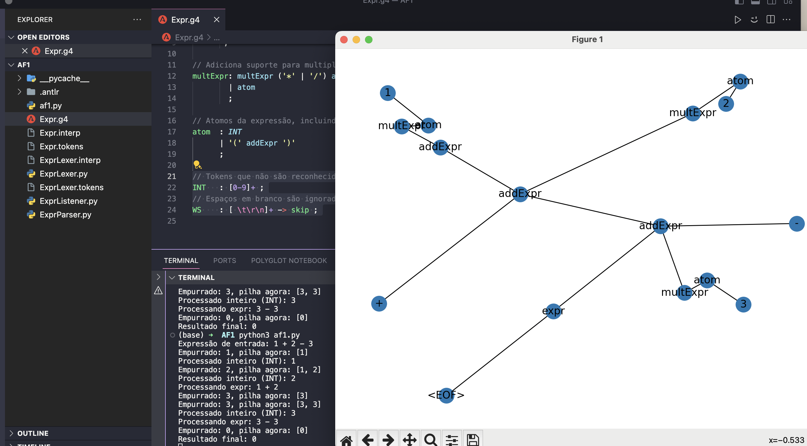

<h1 align="center">
    
</h1>

ANTLR com Python

# AF1 com ANTLR e Python
    

📌 ANTLR com Python: AF1 de Compilação
------------------
1. Escreva um programa que dada uma expressão com número inteiros sem sinal e apenas com os operadores '+' e '-' reescreva essa expressão na notação pós-fixa.

2. Acrescente ao programa anterior os operadores '*' e ´/', com a habitual precedência, a possibilidade de os números terem sinal '+' ou '-' e os parênteses.

3. Implemente os programas anteriores usando a ferramenta ANTLR.

## Pré-requisitos

- Java (para executar o ANTLR).
- ANTLR4 (baixe `antlr-4.x-complete.jar` do [site oficial do ANTLR](https://www.antlr.org/)).
- Python 3.
- Bibliotecas Python: `antlr4-python3-runtime`, `networkx`, `matplotlib`.

## Passo a Passo

Codigo af1.py

### 1. Criar a Gramática ANTLR

Definimos a gramática no arquivo `Expr.g4`:
 
## 2. Gerar os Ficheiros Python com ANTLR

Utilizamos o seguinte comando para gerar os analisadores léxico e sintático em Python a partir da nossa gramática:

<pre>java -jar /Users/ivobaptista/Downloads/antlr-4.13.1-complete.jar -Dlanguage=Python3 Expr.g4 </pre>

Certifique-se de substituir /caminho/para/antlr-4.x-complete.jar pelo caminho real onde o arquivo antlr-4.x-complete.jar está localizado no seu sistema.

## 3. Preparar o Ambiente Python

Instalamos as bibliotecas Python necessárias:

<pre> pip install antlr4-python3-runtime networkx matplotlib </pre>

## 4. Escrever e executar o Script de Teste em Python

af1.py (Esta todo comentado). Este script carrega a entrada print("Hello, World!"), executa a análise sintática, e visualiza a árvore de análise resultante.

<pre> python3 af1.py </pre>

Deve aparecer a mensagem impressa no console, seguida pela visualização da árvore de análise sintática

Expressão de entrada: 1 + 2 - 3
Empurrado: 1, pilha agora: [1]
Processado inteiro (INT): 1
Empurrado: 2, pilha agora: [1, 2]
Processado inteiro (INT): 2
Processando expr: 1 + 2
Empurrado: 3, pilha agora: [3]
Empurrado: 3, pilha agora: [3, 3]
Processado inteiro (INT): 3
Processando expr: 3 - 3
Empurrado: 0, pilha agora: [0]
Resultado final: 0

O projeto foi feito em Python com ANTLR

The project was done with Python with ANTLR

🔧 Tecnologias utilizadas:
------------------

- Python
- ANTLR 
- VS code

💬 Fale comigo
------------------
[*Entre em contato comigo*](https://www.linkedin.com/in/ivo-baptista-3712144/)

